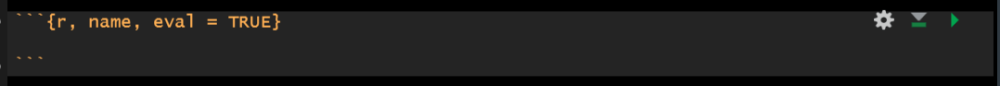

```{r, echo=FALSE, eval = F}

xaringanExtra::use_logo("../img/logo.png", width = "30px", height = "30px", link_url = "https://fundrmentals.netlify.app/")

```

```{r setup, include=FALSE}
library(xaringanthemer)
library(xaringanExtra)
library(tidyverse)

options(htmltools.dir.version = FALSE)
xaringanExtra::use_clipboard()
xaringanExtra::use_panelset()
```

```{r xaringan-themer, include=FALSE, warning=FALSE}

style_mono_light(
  base_color = "#23395b"
)

```


# Setup & Q&A

- Open RStudio

- Open your fundRmentals R Project (click the blue cube in the top right corner of RStudio)

- Open a new Rmd file for today

- In a new code chunk, load **tidyverse**, **palmerpenguins**, **knitr**, & **kableExtra**, using the **library()** command (install them in the console if you need to)

- In another code chunk, create a **peng_data_smry** table by copying & running the below code:

<br>

```{r}
peng_data_smry <- palmerpenguins::penguins %>% na.omit() %>% dplyr::group_by(., species) %>%
  dplyr::summarise(., avg_mass = mean(body_mass_g), sd_mass = sd(body_mass_g), 
                   avg_flipper_l = mean(flipper_length_mm), 
                   sd_flipper_l = sd(flipper_length_mm), n = n())


```


```{r, echo = F}
data <- palmerpenguins::penguins %>% na.omit() %>% dplyr::group_by(., species) %>% dplyr::summarise(., avg_mass = mean(body_mass_g), sd_mass = sd(body_mass_g), avg_flipper_l = mean(flipper_length_mm), sd_flipper_l = sd(flipper_length_mm), n = n())


```

<br>


---

# Overview

- `kable` tables

- Code chunk options


- Next steps

---

# knitr::kable() tables

- **knitr::kable()** is just one function we can use in R to create tables
  + **papaja::apa_table()** is also a great one to use ([install info here..](https://fundrmentals.netlify.app/disso_rmarkdown_tutorial.html#installing-papaja))

- For a very basic table we can use **kable()** like this:

```{r, eval = F}
knitr::kable(data)
```

<br>

```{r, echo= F}
knitr::kable(data)
```

<br>

**Task**: try out **knitr::kable()** on our **peng_data_smry**, knit your doc to see it!

---

# knitr::kable() tables

To make our table prettier, we can set some basic options within the **kable()** function, including **col.names**, **caption** & **digits**:

<br>

```{r, echo = T, eval = F}

knitr::kable(data, 
             col.names = c("New Column Name 1", "New Column Name 2", "New Column Name 3"), 
             caption = "This is the caption for my pretty table made with knitr::kable().", 
             digits = 3)
```

<br>
<br>
<br>
<br>
<br>
<br>

**Task**: modify our kable table so that the column names are more presentable (with capital letters & spaces) & to have **2** decimal places

---

# Solution


```{r, eval = F}

knitr::kable(peng_data_smry, 
             col.names = c("Species", "Mean Body Mass", "SD Body Mass", "Mean Flipper Length", 
                           "SD Flipper Length", "Frequencies"),
             digits = 2)
```

<br>

```{r, echo = F}

knitr::kable(peng_data_smry, 
             col.names = c("Species", "Mean Body Mass", "SD Body Mass", "Mean Flipper Length", "SD Flipper Length", "Frequencies"), 
             digits = 2)
```


---

# kableExtra::kable_styling()

- The **kableExtra** package extends the functionality of **knitr::kable()** to make our tables super pretty 

- You can pipe **%>%** the output of **knitr::kable()** into the styling functions of **kableExtra**

- The most common function we're going to use is **kableExtra::kable_styling()**

- The most useful arguments of **kableExtra::kable_styling()** are **font_size**, **full_width**, **position**, & **bootstrap_options** with the following options:

<br>

```{r, eval = F}
font_size = 12 # any number for font size

full_width = TRUE or FALSE  

position = "left", "right" or "center"

bootstrap_options = "basic", "striped", "bordered", "hover", or "condensed"
```

---

# Piping it all together %>% 

To put it all together, we could write something like this:

```{r, eval = F}
knitr::kable(data, 
             col.names = c("New Column Name 1", "New Column Name 2", "New Column Name 3"), 
             caption = "This is the caption for my pretty table made with knitr::kable().", 
             digits = 3) %>% 
  kableExtra::kable_styling(
    font_size = 10, 
    full_width = TRUE, 
    position = "right", 
    bootstrap_options = "striped")
```


<br>
<br>
<br>
<br>
<br>

**Task**: add in some **kableExtra::kable_styling()** to our kable table, choose any **font_size** you like, set **full_width** to be **FALSE**, **position** it in the **center**, and set **bootstrap_options** to be **bordered**, then knit your doc!

---

# Solution

```{r, eval = F, echo = T}
knitr::kable(peng_data_smry, 
             col.names = c("Species", "Mean Body Mass", "SD Body Mass", "Mean Flipper Length", 
                           "SD Flipper Length", "Frequencies"), 
             digits = 2) %>% 
  kableExtra::kable_styling(
    font_size = 12, 
    full_width = FALSE, 
    position = "center", 
    bootstrap_options = "bordered")
```

<br>

```{r, echo = F}
knitr::kable(peng_data_smry, 
             col.names = c("Species", "Mean Body Mass", "SD Body Mass", "Mean Flipper Length", 
                           "SD Flipper Length", "Frequencies"), 
             digits = 2) %>% 
  kableExtra::kable_styling(
    font_size = 12, 
    full_width = FALSE, 
    position = "center", 
    bootstrap_options = "bordered")
```


---

# Code Chunk Options

- Our knitted file doesn't look so great with all our code included! `r emo::ji("crying_face")`

- But not to fear! We can easily change this by setting different code chunk options such as: 
  + **eval = FALSE** (code is not run)
  + **echo = FALSE** (code is not shown, but the output is)
  + **message = FALSE** (messages are not shown)
  + **warning = FALSE** (warnings are not shown)
  
- We can even use a mix of these in the same code chunk to get the desired output

An example code chunk with a **name** & **eval = TRUE** set

```{r, echo = F, fig.align='center'}

```


**Task**: set the code chunk options so that the code creating your tables **is not shown** in the knitted file & see how it looks!

---

# You made it to the end!! 

- Well done for getting through to the end of this whirlwind couRse!! `r emo::ji("partying_face")`
- You've all done amazingly and I'm very grateful for your patience and motivation (I know deep, deep down that maybe everyone doesn't absolutely *love* R... so huge well done for sticking with it!)


- As a reminder, you can access all materials on the website along with some additional resources:
  + [R-DEX: find teaching materials from previous UG modules](https://fundrmentals.netlify.app/resources#the-r-dex)
  + [Useful functions from the course](https://fundrmentals.netlify.app/functions.html)
  + [Submit your *how do I* questions](https://fundrmentals.netlify.app/HowDoI.html)
  
  
- For supervising projects, students will have access to an R help desk and analyses workshops with me and Jennifer Mankin, they also have access to the [R-DEX](https://canvas.sussex.ac.uk/courses/15834/pages/analyses-and-statistics) which you can refer them to if you get any 'How do I?' questions 


[**FundRmentals feedback form**](https://docs.google.com/forms/d/e/1FAIpQLScpQQXv9FL-dFWFpdF1YGRwm4IYDAktfSGfVrHo-_e0vk24qA/viewform?usp=sf_link) 
- Please feel free to [answer a few questions here](https://docs.google.com/forms/d/e/1FAIpQLScpQQXv9FL-dFWFpdF1YGRwm4IYDAktfSGfVrHo-_e0vk24qA/viewform?usp=sf_link) about the course, and also comment any things you might want or find helpful in the future
- You can be brutally honest, I'll try not to take it to heaRt `r emo::ji("smile")`


