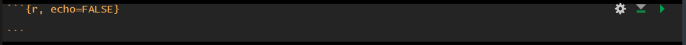

```{r, echo=FALSE, eval = F}

xaringanExtra::use_logo("../img/logo.png", width = "30px", height = "30px", link_url = "https://fundrmentals.netlify.app/")

```

```{r setup, include=FALSE}
library(xaringanthemer)
library(xaringanExtra)
library(tidyverse)

options(htmltools.dir.version = FALSE)
xaringanExtra::use_clipboard()
xaringanExtra::use_panelset()
```

```{r xaringan-themer, include=FALSE, warning=FALSE}

style_mono_light(
  base_color = "#23395b"
)

```


# Setup & Q&A

- Open RStudio
- Open your fundRmentals R Project (click the blue cube in the top right corner of RStudio)
- Open a new Rmd file for today
- Install the **palmerpenguins** package by running the code below in the console:

```{r, eval = F}
install.packages("palmerpenguins")
```

- In a new code chunk, load **tidyverse** & **palmerpenguins** using the **library()** command
- In another code chunk, create **peng_data** by copying the below code:

```{r}
peng_data <- palmerpenguins::penguins
```

<br>

.center[

### Any questions from the last tutorial?

]

---

# Overview

- ggplot2

- Scatterplot  

- Means plot

- Next steps

---

# ggplot2

- **ggplot2** is a really useful package (part of tidyverse) for data visualisation

- We use the **ggplot2::ggplot()** function to create plots

- Plots are built in layers from 3 key components: **data**, **coordinate system**, & **geometric elements (geoms)**

- Plots created with **ggplot2** are *super* customisable, you can make pretty much anything you can imagine

- Because it's pretty much unlimited, there is a huge amount of resources online & there is no need to memorise everything, we can easily look it up!

- Today we're going to try creating a few plots with the **palmerpenguins** data! 

```{r, fig.align='center', out.width="32%", echo=FALSE}
knitr::include_graphics("../img/peng.png")
```


---

# ggplot2::ggplot()

- Built layer by layer **+**

- Variables are mapped onto elements of the plot as 'aesthetics'
  + We use **aes()** to include variable(s) as an *aesthetic*
  
- **Geoms** are 'visual marks' that represent data points e.g.
  + **geom_bar()** – creates a layer of bars

  + **geom_point()** – creates a layer of data points

  + **geom_histogram()** – creates a layer with a histogram

  + **geom_text()** – creates layer with text on

& many more options...

---

# Plot Building Process

1. Create base layer by specifying the **data** & the **variables** to map onto the plot

1. Add **geom** layer (to display our data points)

1. Add/edit visual properties (**scale**, **colours**, **shapes** etc.)

1. Add semantic properties (e.g. **title**, **labels**)

1. Add a **theme** to make our plot pretty


---

# Scatterplots

.panelset[

.panel[.panel-name[Code]  

.tiny[

```{r scatter-1-code, fig.show = 'hide', warning = F}

peng_scatter <- ggplot2::ggplot(peng_data, aes(x = bill_length_mm, y = bill_depth_mm))
peng_scatter +
  geom_point() +
  labs(title = "Scatterplot of Bill Length & Bill Depth", x = "Bill Length (mm)", y = "Bill Depth (mm)") + 
  theme_bw()

```

]

<br>
<br>
<br>
<br>
<br>
<br>
<br>

**Task**: Create a scatterplot of **peng_data** with **body_mass_g** on the x axis, **flipper_length_mm** on the y axis  

.panel[.panel-name[Plot]  

```{r scatter-1-plot, echo = FALSE, warning = F, fig.align = 'center', fig.width=6, fig.height=6}

peng_scatter <- ggplot2::ggplot(peng_data, aes(x = bill_length_mm, y = bill_depth_mm))
peng_scatter +
  geom_point() +
  labs(title = "Scatterplot of Bill Length & Bill Depth", x = "Bill Length (mm)", y = "Bill Depth (mm)") + 
  theme_bw()

```

]

.panel[.panel-name[Code]  

.tiny[

```{r scatter-2-code, fig.show = 'hide', warning = F, message=FALSE}

peng_scatter <- ggplot2::ggplot(peng_data, aes(x = bill_length_mm, y = bill_depth_mm))
peng_scatter +
  geom_point(colour = "dark blue", size = 3, shape = 20, alpha = .5) +
  geom_smooth(method = "lm", se = FALSE, colour = "orange") +
  labs(title = "Scatterplot of Bill Length & Bill Depth", x = "Bill Length (mm)", y = "Bill Depth (mm)") + 
  theme_bw()

```

]

<br>

We can make it more *fancy* by changing the **colour**, **size**, **shape** & **alpha** (transparency) of the points, & by adding a regression line (the **geom_smooth** layer)

<br>
<br>

**Task**: Edit your previous scatterplot by changing the different options for displaying the points & add a regression line

]

]

.panel[.panel-name[Plot]  

```{r scatter-2-plot, echo = FALSE, warning = F, fig.align = 'center', fig.width=6, fig.height=6, message=FALSE}

peng_scatter <- ggplot2::ggplot(peng_data, aes(x = bill_length_mm, y = bill_depth_mm))
peng_scatter +
  geom_point(colour = "dark blue", size = 3, shape = 20, alpha = .5) +
  geom_smooth(method = "lm", se = FALSE, colour = "orange") +
  labs(title = "Scatterplot of Bill Length & Bill Depth", x = "Bill Length (mm)", y = "Bill Depth (mm)") + 
  theme_bw()

```

]]


---


# Means Plots

.panelset[

.panel[.panel-name[Code]  

.tiny[

```{r plot-means-code, fig.show = 'hide', warning = F}

peng_means <- ggplot2::ggplot(peng_data, aes(x = species, y = flipper_length_mm))
peng_means +
  stat_summary(fun = "mean", geom = "point", size = 4, colour = "orange") +  
  labs(title = "Mean Flipper Length per Penguin Species", x = "Species", y = "Flipper Length (mm)") + 
  theme_minimal()

```

]

<br>
<br>
<br>
<br>
<br>
<br>
<br>


**Task**: Create a means plot of **peng_data** with **island** on the x axis, **body_mass_g** on the y axis  

]

.panel[.panel-name[Plot]  

```{r means-plot, echo = FALSE, warning = F, fig.align = 'center', fig.width=6, fig.height=6}

peng_means <- ggplot2::ggplot(peng_data, aes(x = species, y = flipper_length_mm))
peng_means +
  stat_summary(fun = "mean", geom = "point", size = 4, colour = "orange") +  
  labs(title = "Mean Flipper Length per Penguin Species", x = "Species", y = "Flipper Length (mm)") + 
  theme_minimal()

```

]]

???

n the stat_summary() function, we’re asking  to calculate the means (fun = “mean”). The argument geom = “point” asks ggplot2 to display the means as dots using geom_point().


---

# Adding CIs

.panelset[

.panel[.panel-name[Code]  

.tiny[

```{r plot-meansci-code, fig.show = 'hide', warning = F}

peng_means <- ggplot2::ggplot(peng_data, aes(x = species, y = flipper_length_mm))
peng_means +
  stat_summary(fun.data = "mean_cl_normal", geom = "pointrange", colour = "orange") +  
  labs(title = "Mean Flipper Length per Penguin Species", x = "Species", y = "Flipper Length (mm)") + 
  theme_minimal()

```

]

<br>
<br>
<br>
<br>
<br>
<br>
<br>


**Task**: Edit our means plot to display confidence intervals  

]

.panel[.panel-name[Plot]  

```{r meansci-plot, echo = FALSE, warning = F, fig.align = 'center', fig.width=6, fig.height=6}

peng_means <- ggplot2::ggplot(peng_data, aes(x = species, y = flipper_length_mm))
peng_means +
  stat_summary(fun.data = "mean_cl_normal", geom = "pointrange", colour = "orange") +  
  labs(title = "Mean Flipper Length per Penguin Species", x = "Species", y = "Flipper Length (mm)") + 
  theme_minimal()

```

]]

---

# Changing the Coordinate System  


.panelset[

.panel[.panel-name[Code]  

.tiny[

```{r coord-code, warning=FALSE, fig.show = 'hide'}

peng_means <- ggplot2::ggplot(peng_data, aes(x = species, y = flipper_length_mm))
peng_means +
  stat_summary(fun.data = "mean_cl_normal", geom = "pointrange", colour = "orange") +  
  labs(title = "Mean Flipper Length per Penguin Species", x = "Species", y = "Flipper Length (mm)") + 
  coord_cartesian(ylim = c(0, 250)) +
scale_y_continuous(breaks = seq(0, 250, 50)) +
  theme_minimal()

```

]

<br>
<br>
<br>
<br>
<br>

**Task**: Using the means plot in the previous task, alter the y axis & add appropriate scale breaks (use your judgement here for what would be appropriate)  

]

.panel[.panel-name[Plot]  

```{r coord-plot, echo = FALSE, warning = F, fig.align = 'center', fig.width=6, fig.height=6}

peng_means <- ggplot2::ggplot(peng_data, aes(x = species, y = flipper_length_mm))
peng_means +
  stat_summary(fun.data = "mean_cl_normal", geom = "pointrange", colour = "orange") +  
  labs(title = "Mean Flipper Length per Penguin Species", x = "Species", y = "Flipper Length (mm)") + 
  coord_cartesian(ylim = c(0, 250)) +
scale_y_continuous(breaks = seq(0, 250, 50)) +
  theme_minimal()

```

]]


---

# Top Tips

- Run & inspect every change you make  
- Be aware that creating plots with ggplot is often a long process   
- A really common error is forgetting the **+** for each layer  
- Set code chunk options to echo = FALSE (plot is displayed but the code isn't):

```{r, fig.align='center', out.width="100%", echo=FALSE}

```

### Next Steps

Save the RMarkdown document from today **Ctrl + S** or **Command + S**

For next week you should complete the **discovr_09** tutorial on comparing means by pasting the below code into the **Console** in RStudio, pressing **Enter** 

```{r, eval = F, echo = T}

learnr::run_tutorial("discovr_09", package = "discovr")

```


