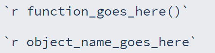
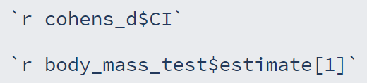

```{r, echo=FALSE, eval = F}

xaringanExtra::use_logo("../img/logo.png", width = "30px", height = "30px", link_url = "https://fundrmentals.netlify.app/")

```

```{r setup, include=FALSE}
library(xaringanthemer)
library(xaringanExtra)
library(tidyverse)

options(htmltools.dir.version = FALSE)
xaringanExtra::use_clipboard()
xaringanExtra::use_panelset()
```

```{r xaringan-themer, include=FALSE, warning=FALSE}

style_mono_light(
  base_color = "#23395b"
)

```


# Setup & Q&A

- Open RStudio

- Open/create your fundRmentals R Project (click the blue cube in the top right corner of RStudio)

- Open a new Rmd file for today

- **If you missed last week**, install the **palmerpenguins** package - install.packages("palmerpenguins")

- Install the **GGally**, **correlation**, & **effectsize** packages

- In a new code chunk, load **tidyverse**, **palmerpenguins**, **GGally**, **correlation** & **effectsize** using the **library()** command

- In another code chunk, create **peng_data** by copying the below code:

```{r}
peng_data <- palmerpenguins::penguins %>% na.omit()
```

.center[

### Any questions from the last tutorial?

]

---

# Overview

- Correlations

- Independent *t*-test

- Reporting results with inline code (extRa)

- Next steps

---

# Correlations: Visualization

- Visualising relationships is made easy with the **GGally::ggscatmat()** function

- **GGally::ggscatmat()** shows us a correlation matrix, with distributions, scatterplots, & correlation coefficients

- To use it, we give the names of our data & the variables we want to examine

```{r, eval = F}
GGally::ggscatmat(data, columns = c("variable 1", "variable 2", "variable 3"))
```

<br>
<br>
<br>
<br>
<br>
<br>
<br>

**Task**: using **peng_data**, use the GGally::ggscatmat() function on **body_mass_g**, **flipper_length_mm**, **bill_depth_mm**

---

.center[

```{r, warning=FALSE, message=FALSE}
GGally::ggscatmat(peng_data, columns = c("body_mass_g", "flipper_length_mm", "bill_depth_mm"))
```

]

---

# Correlations: Tests

- We can use the correlation::correlation() function to perform a correlation, the default options are given below:

```{r, eval = F}
correlation::correlation(data,
                         method = "pearson",
                         p_adjust = "holm",
                         ci = 0.95
                         )
```

<br>

- If we are happy with these defaults, we can pipe in the data we want to use, and select the variables: 

```{r, eval = F}
data %>% 
  dplyr::select(variable_1, variable_2) %>% 
correlation::correlation()
```

<br>

**Task**: perform a correlation with our **peng_data**, on the **body_mass_g** & **flipper_length_mm** variables, save it in an object (<-)

---

# Correlations: Tests

.tiny[

```{r}
peng_cor <- peng_data %>% 
  dplyr::select(body_mass_g, flipper_length_mm) %>%
  correlation::correlation()
peng_cor
```

<br>

We can even edit the number of decimal places if we wanted to:

```{r, eval = F}
peng_cor <- peng_data %>% 
  dplyr::select(body_mass_g, flipper_length_mm) %>% 
  correlation::correlation(digits = 3, ci_digits = 3)
```

]

---

# Comparing Independent Means: *t*-test

- We can use the t.test function to perform a *t*-test, this function has the following arguments & defaults:

- We sub in our column names for the outcome & predictor, the name of our dataset, whether we want a paired *t*-test or not, whether we want Welch's correction (the correction is the default), the confidence interval, and whether to exclude missing data (na.action = na.exclude)

.tiny[

```{r, eval = F}
t.test(outcome ~ binary_predictor, data = data, paired = FALSE, var.equal = FALSE, conf.level = 0.95)
```

]

<br>
<br>
<br>
<br>
<br>

**Task**: perform an independent *t*-test with our **peng_data**, using the **sex** & **body_mass_g** variables, keep the default options of Welch's correction & 95% CIs, give the object a name (<-)

---

# Comparing Independent Means: *t*-test

```{r}
body_mass_test <- t.test(body_mass_g ~ sex, data = peng_data)
body_mass_test
```

---

# Comparing Independent Means: Effect Size

- We can calculate effect size just as easy as doing a *t*-test with the effectsize::cohens_d() function:

```{r, eval = F}
cohens_d <- effectsize::cohens_d(outcome ~ binary_predictor, data = data)
```
<br>

**Task**: calculate cohen's d for the *t*-test we just did! Make sure to save it in an object

<br>
<br>

--

```{r}
cohens_d <- effectsize::cohens_d(body_mass_g ~ sex, data = peng_data)
cohens_d
```

---

# ExtRa: Reporting Results

.pull-left[

- We can report the results of these tests using inline code: 

- By saving all our results into objects we can access the values contained within them
]

.pull-right[

```{r, echo = F, out.width="80%", fig.align='center'}

```

]


- We need to know the name of the object & the name of the element

- We can look in our environment pane & click the blue 'play button' next to the name of the object to see what it contains & what the elements are called

.pull-left[

- We can then select individual elements by using the $

- If there's more than one value in an element, we can use [] & the number of the one we want

]

.pull-right[

```{r, echo = F, out.width="90%", fig.align='center'}

```

]

**Task**: try it out on some of your results & knit your doc! 

---

# Next Steps

Save the RMarkdown document from today **Ctrl + S** or **Command + S**

For next week you should complete the **discovr_08** tutorial on the linear model by pasting the below code into the **Console** in RStudio, pressing **Enter** 

```{r, eval = F, echo = T}

learnr::run_tutorial("discovr_08", package = "discovr")

```

???

write_csv(peng_cor, file = "cor.csv")
write_csv(broom::tidy(body_mass_test), file = "ttest.csv")
write_csv(cohens_d, file = "cohens.csv")


